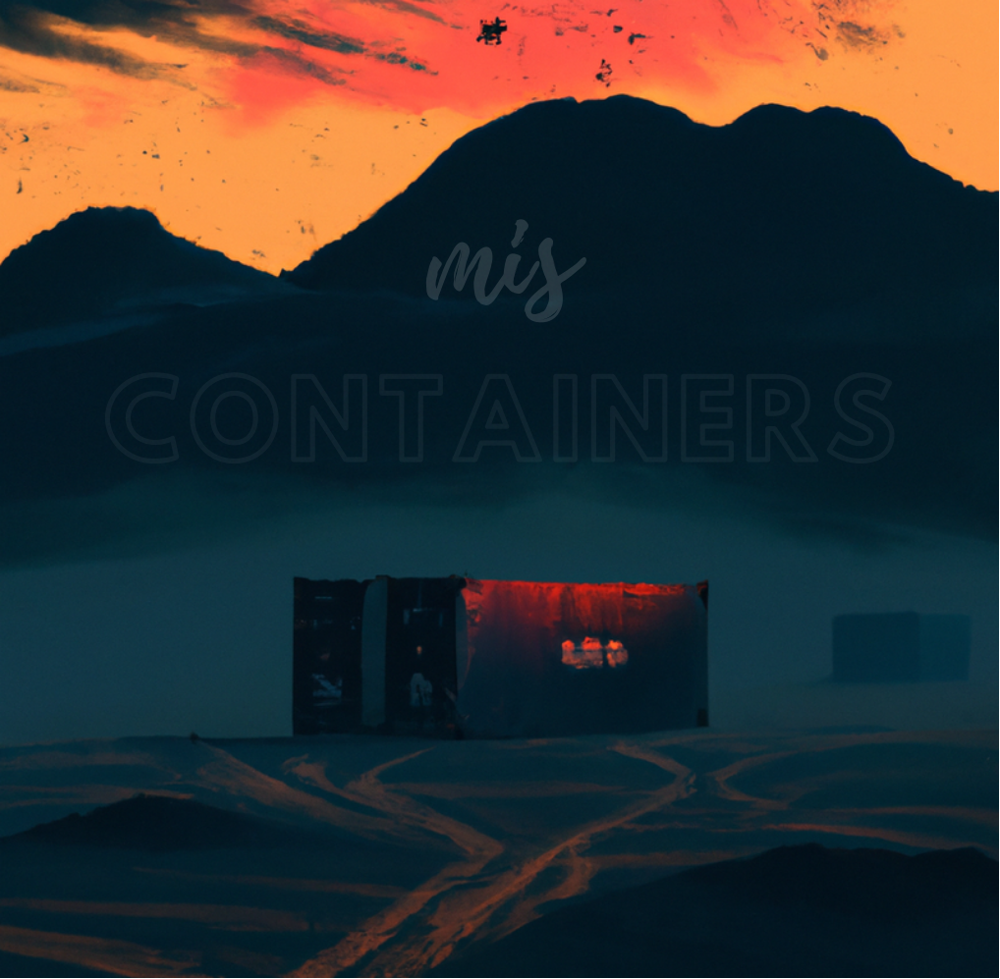

# How Misconfigurations Can Sink Your Containers

"Are you curious about the safety of containers in today's cloud-based world? With the rise of Infrastructure as Code, it's more important than ever to make sure your container configuration is rock solid.

Learn about the potential vulnerabilities that can arise from common misconfigurations, and how attackers might exploit them to gain access to your applications and infrastructure."

---

